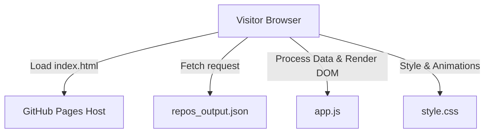

# 🌟 BIBLE.md — Starred Repos Portfolio Dashboard

This document is the sole source of truth for the Starred Repos Portfolio Dashboard. All architectural decisions, design patterns, schemas, and specifications are compiled here.

---

## 📋 1. PRD (Product Requirements Document)
*   **Purpose:** Build a premium, high-performance static web dashboard that loads `repos_output.json` dynamically and displays starred repositories in a searchable, filterable, and beautifully styled card grid.
*   **Target User:** Single user (`Codekiller`), recruiting managers, and open-source contributors looking at the profile.
*   **Core Workflows:**
    1.  **Load & Initialize:** Fetch the parent directory's `repos_output.json` relatively. Cache the data structure in memory.
    2.  **Filter & Search:** Real-time search on titles, languages, and descriptions with visual highlight feedback and tag-based filtering (e.g., clicking on the "AI Agents" category tab).
    3.  **Explore Details:** Cards expand to show full details, including a clean display of the extracted README summary snippet.
*   **Budget & Deployment:** ₹0 budget. Served statically via GitHub Pages from the repository root (or `/dashboard` folder).

---

## 👥 2. Roles
*   **System Owner / Admin:** `Codekiller` (Full root control, configurations exposed via a client-side Settings panel).
*   **End User:** Public visitor (Read-only access to search, filter, and explore stars).

---

## 🛠️ 3. Stack
| Layer | Technology | Why Best | Alternatives Considered | Cons | Neutralization |
| :--- | :--- | :--- | :--- | :--- | :--- |
| **Frontend UI** | HTML5 / CSS3 / Vanilla JS | Natively parsed by browser. Zero compile steps, zero bundle overhead. Best for high-refresh scrolling (120Hz). | React / Next.js (Rejected: requires compilation and node_modules). Tailwind CSS (Rejected: needs build process). | Lacks component abstraction. | Use ES6 template strings and class-based DOM reference caching. |
| **Data Engine** | Local Static JSON | Load times under 100ms. No database connection setup needed. | Supabase / MongoDB (Rejected: overkill for read-only static list). | Must keep files in sync. | Managed automatically by the daily GitHub Action. |
| **Hosting** | GitHub Pages | Free hosting, automatic deploys on git push. | Vercel / Netlify (Rejected: Pages keeps everything in one git ecosystem). | Cold start latency on first build. | Minimal builds, instant deployment. |

---

## 📐 4. HLD/LLD (High & Low Level Design)

### High-Level Architecture


### Low-Level Modules (Vanilla JS)
*   **`AppLogger`**: Custom JSON Logger class.
*   **`DataManager`**: Fetches the JSON file, sanitizes missing fields, and runs memory-cached query filtering.
*   **`UIManager`**: Pre-renders elements once. Manages card visibility toggles (`.hidden` state) on search inputs and filters.
*   **`SettingsManager`**: Manages state for custom settings (card limits, default layout mode, theme overrides) using `localStorage`.

---

## 🗄️ 5. DB Schema (Static JSON Schema)
The system reads the structured output of `repos_output.json`:

```json
{
  "$schema": "http://json-schema.org/draft-07/schema#",
  "type": "OBJECT",
  "properties": {
    "username": { "type": "STRING" },
    "total_repos": { "type": "INTEGER" },
    "generated_at": { "type": "STRING", "format": "date-time" },
    "repos": {
      "type": "ARRAY",
      "items": {
        "type": "OBJECT",
        "properties": {
          "rank": { "type": "INTEGER" },
          "full_name": { "type": "STRING" },
          "stars": { "type": "INTEGER" },
          "language": { "type": "STRING" },
          "description": { "type": "STRING" },
          "readme_summary": { "type": "STRING" },
          "readme_found": { "type": "BOOLEAN" },
          "url": { "type": "STRING", "format": "uri" },
          "last_updated": { "type": "STRING", "format": "date-time" }
        },
        "required": ["rank", "full_name", "stars", "url"]
      }
    }
  },
  "required": ["username", "total_repos", "generated_at", "repos"]
}
```

---

## 🔌 6. API Spec (Static Data Loading)
*   **Endpoint:** `GET ../repos_output.json`
*   **Query Parameters:** None (Client-side handles all search/filter queries locally).
*   **Client Routing:** Single Page Application (Hash-based router `#category=ai-agents` for shareable filter states).

---

## 🔒 7. Security
*   **No API Keys Exposes:** No tokens, passwords, or personal access tokens are stored in the frontend files.
*   **Content Security Policy (CSP):** Standard static site settings, zero inline scripts or unverified third-party libraries.
*   **Sanitization:** Text inputs are escaped using standard browser DOM functions (`element.textContent`) to prevent Cross-Site Scripting (XSS).

---

## 🎨 8. UI & Screens
*   **Theme:** Premium deep dark mode (`#070a13` background, `#0b0f19` panels, HSL gradient accents `#6366f1` to `#a855f7`).
*   **Layout:**
    *   **Header Section:** Profile identity, quick stats (total repos, categories, top language, average stars).
    *   **Control Panel:** Fuzzy search input, category selection tabs, sort drop-down, and card layout density toggles.
    *   **Card Grid:** Responsive cards featuring rank tags, glowing borders, language indicator chips, and an expandable README summary fold.
    *   **Settings Panel:** Slider for max visible cards, dark/pitch-black theme toggles, and circular buffer log inspector.

---

## 🎯 9. Features
*   **Fuzzy Search:** Filter cards instantly as you type (150ms debounced).
*   **Fast Category Filters:** One-click filter tabs to filter by AI Agents, Web Automation, DevOps, and Dev Tools.
*   **Sorting Modes:** Sort by Star Count (descending/ascending), Rank, and Name.
*   **Local Settings Control:** Full settings panel to customize card density, theme, and logs.

---

## 🏃 10. Sprints (Implementation Plan)
*   **Sprint 1: Foundation & Logging**
    *   Setup HTML structure, styling variables, and `AppLogger` system.
*   **Sprint 2: Data Fetching & Rendering**
    *   Implement async fetch modules, parse repository objects, and perform initial card grid generation.
*   **Sprint 3: Filtering & Search Engine**
    *   Implement debounced fuzzy search, category tabs, and sorting drop-downs.
*   **Sprint 4: Settings & Final Polish**
    *   Create settings control panel, glassmorphism animations, and verify layouts on mobile and desktop.

---

## 🚀 11. Deploy
1. The code is written inside the `/dashboard` directory.
2. Changes are pushed to the remote repository.
3. GitHub Pages is configured to serve from the `main` branch. The page is instantly accessible at: `https://AkashPriyadarshii.github.io/My-Starred-Repos/dashboard/`.

---

## 🧪 12. Testing
*   **Fuzzy Search Validation:** Test filtering with terms containing special characters. Assert performance.
*   **Responsive Layout Checks:** Verify layouts rendering correctly at 360px (mobile) up to 2560px (ultra-wide monitors).
*   **Performance Metrics:** Run Lighthouse audit. Aim for 100/100 performance score (sub-100ms Largest Contentful Paint).

---

## 📈 13. Monitoring & Logger System
*   **`AppLogger`** keeps logs in a local circular buffer of 500 entries.
*   Log formats conform to:
    ```json
    {
      "timestamp": "2026-05-25T17:19:28.000Z",
      "level": "INFO",
      "module": "NETWORK",
      "event": "FetchDataCompleted",
      "payload": { "total_repos": 317 },
      "duration_ms": 42
    }
    ```
*   Logs can be exported directly as a JSON file or viewed via the settings control panel.

---

## ⚠️ 14. Constraints & Risks
*   **No Build System:** Pure standard native JS. Avoid packages from npm or node modules.
*   **Large JSON Loading:** JSON must not block the main thread. Solution: load asynchronously using `defer` on script tags.
*   **₹0 Cost Constraint:** Strict dependency on free static hosting (GitHub Pages).

---

## 🧠 15. Decision Log
*   *Decision:* Pre-render cards on page load and toggle `.hidden` state.
    *   *Alternative:* Recreate elements dynamically on every search query.
    *   *Reason:* Toggling visibility is significantly faster and eliminates garbage collection stutters.

---

## 🔧 16. Onboarding & Environment
*   **Local Setup:** Run any simple HTTP server in the repository root directory (e.g., `python -m http.server 8000` or double-click `index.html` via file protocol since resources are relative).
*   **Environment Variables:** None (all values computed dynamically in runtime).

---

## 📜 ##PROMPTS

### Sprint 1 Prompt (Foundation & UI Architecture)
```text
Build the foundation folder and UI file structure for the dynamic Starred Repos Dashboard. Create a directory named dashboard/ containing index.html, style.css, and app.js. Implement the full theme system using HSL CSS variables, custom typography, dark background styling, and the AppLogger singleton in app.js for logging initialization phases. Ensure index.html includes structural containers for the Header, Control Panel, Grid, and Settings panel. Do not include search logic or actual card components yet.
```

### Sprint 2 Prompt (Data Loading & Rendering)
```text
Implement the asynchronous data loading logic in app.js. Fetch the parent directory's repos_output.json relatively. Bind data processing errors to AppLogger and display error overlays if the file fails to load. Render the parsed list of 317 repositories into the HTML card container, mapping ranks, star counts, descriptions, languages, and README summaries into custom template structures with micro-animations and border glows.
```

### Sprint 3 Prompt (Search & Sorting Engine)
```text
Implement the debounced fuzzy search and category tab filter system. Add input listener to search bar with 150ms debouncing. Loop through pre-rendered cards and toggle the class ".hidden" based on text matches in title, language, description, and readme_summary. Connect the category tabs to filter by tag prefixes and sorting drop-downs to re-order cards dynamically on the screen using CSS flex/grid order attributes.
```

### Sprint 4 Prompt (Settings Control & Polish)
```text
Implement the settings inspector in the dashboard interface. Create controls for layout density selection, maximum visible cards sliders, dark/pitch-black theme overrides, and a log reader displaying the AppLogger circular buffer. Polish glassmorphism backdrop blurs, transition durations, and verify mobile responsiveness and touch gestures.
```

---

## 📁 ##CLAUDE.md

```markdown
# Starred Repos Dashboard

## Identity & Mission
You are an expert frontend engineering agent building a premium, dependency-free portfolio dashboard for the developer's starred repositories.

## Tech Stack
*   HTML5 (Semantic elements only)
*   CSS3 (Vanilla custom properties, Grid, Flexbox, backdrop-filter)
*   JavaScript (ES6+, Vanilla DOM, asynchronous Fetch API)

## Key Files
*   `dashboard/index.html` - Base application interface
*   `dashboard/style.css` - Custom styling theme engine
*   `dashboard/app.js` - Data handling, fuzzy search, and logger execution

## Constraints
*   **₹0 Budget:** Must run completely free on GitHub Pages.
*   **Zero Dependencies:** Do not import any NPM packages, Tailwind CLI, compiler layers, or build scripts. 
*   **One User Mode:** Single-user design, optimized for high performance on 120Hz mobile (Realme GT 7) and desktop (MacBook Air).

## Code Style & Rules
*   Never write placeholders or partial code blocks. All code must be complete.
*   Use native custom elements or ES6 template strings for rendering.
*   Always log network actions, sorting changes, search interactions, and error boundaries through the `AppLogger` singleton.
```
